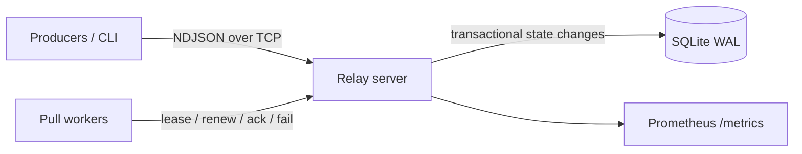
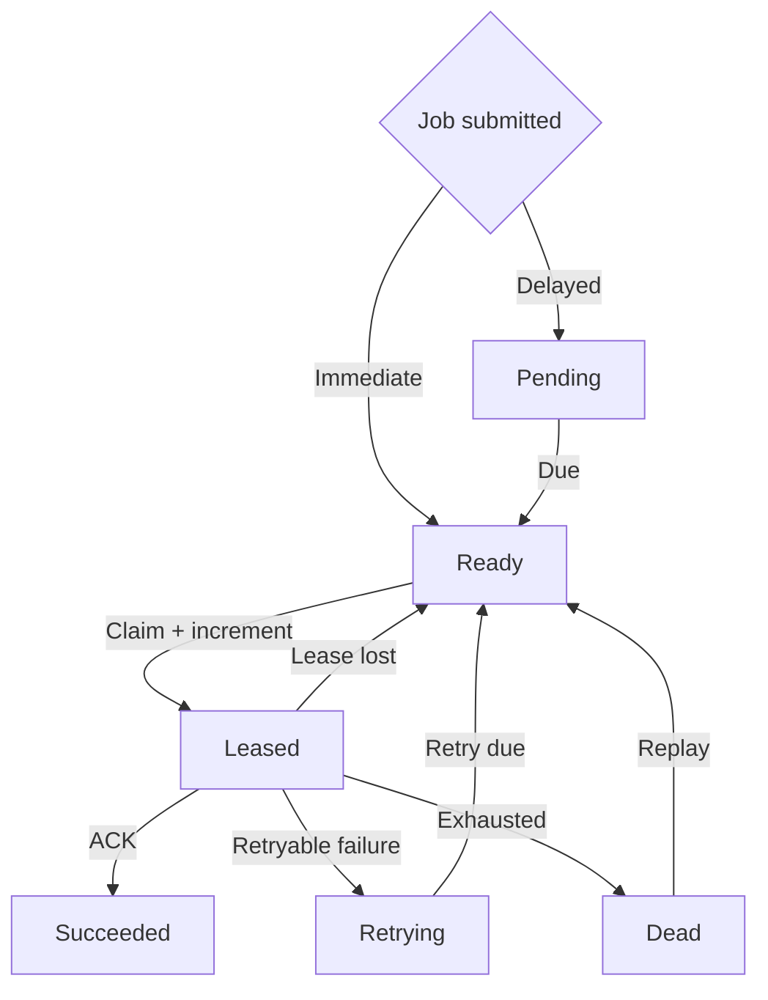

# Relay

Relay is a compact, durable distributed job queue that makes its failure semantics visible: SQLite-backed persistence, pull-based workers, expiring leases, fencing tokens, bounded concurrency, delayed work, retries, and dead letters.

It is an infrastructure study, not a Redis wrapper or a dashboard. The queue provides **at-least-once delivery**. It does not claim exactly-once execution.

## Thirty-second demo

```bash
cargo run --release -- server
# another terminal
cargo run --release -- worker --queue default --concurrency 8
# another terminal
cargo run --release -- submit default --payload '{"hello":"world"}'
cargo run --release -- stats
curl http://127.0.0.1:7401/metrics
```

Inject work and failures with `{"sleep_ms":500}` and `{"fail":true,"error":"demo"}`. The included worker is a safe demonstration executor; applications normally consume with the Rust client and dispatch payloads to their own handlers.

## Architecture



The server deliberately uses one SQLite writer protected by a mutex. Claims run in `BEGIN IMMEDIATE` transactions, so competing workers cannot both obtain a valid lease. This is a simple, auditable single-node coordinator—not a replicated consensus system.

## Job lifecycle



Every lease carries a random fencing token. ACK, failure, and renewal require the job ID, worker ID, current token, and an unexpired lease. A worker returning after reassignment cannot mutate the new owner's job.

## Failure semantics

Relay guarantees at-least-once delivery, not exactly-once execution. If a worker performs an external side effect and crashes before its ACK is committed, the lease expires and another worker executes the job. Consumers must make external effects idempotent (for example, with a unique business operation key).

Submission idempotency keys deduplicate producer retries for a configurable window. They prevent duplicate queue records; they do **not** make external side effects exactly once.

On server restart, unfinished leases become `READY` immediately. Terminal jobs remain terminal. This favors recovery time and can create a duplicate execution if the old worker is still running; its old token can no longer ACK.

## Scheduling and backpressure

- Workers pull only when a semaphore slot is available; a concurrency-8 worker holds at most eight jobs.
- The server caps concurrent connections and frames at 1 MiB. Payloads, queue names, errors, lease duration, and subscription count are bounded.
- SQLite is the durable backlog, so overload grows disk-backed queue depth rather than an in-memory task list.
- Priority uses aging: every minute waited raises effective priority one class, capped at `CRITICAL`, with FIFO tie-breaking. High priority stays responsive while old low-priority jobs cannot starve permanently.
- Retry policies support fixed delay or bounded exponential backoff with optional full-range jitter (50–100% of the bounded delay).

## CLI

```text
relay server --db relay.db --metrics-address 127.0.0.1:7401
relay worker --queue email --queue notifications --concurrency 16
relay submit email --payload '{"user_id":42}' --priority high --retries 5
relay inspect job_...
relay stats
relay dead list --queue email
relay dead retry job_...
relay dead purge job_...
```

Use global `--address HOST:PORT` to select a server. Set `RUST_LOG=relay=debug` for structured JSON logs.

## Correctness and performance

`cargo test --all-targets` covers competing claims, stale ACKs, lease expiry, retries to `DEAD`, delayed jobs, idempotency, and crash/restart recovery. `relay-bench --jobs 100000` measures local durable-submission throughput and latency percentiles. It prints measured results only; this repository does not publish unrepeatable numbers.

See [architecture](docs/architecture.md), [protocol](docs/protocol.md), [failure model](docs/failure-model.md), [design decisions](docs/design-decisions.md), and [benchmarking](docs/benchmarks.md).

## Non-goals and limits

Relay is not multi-region, replicated, a workflow engine, a cron replacement, a sandbox for untrusted code, or an exactly-once system. The coordinator is a single process and SQLite is its scale boundary. Metrics counters reset on restart. Worker discovery is represented operationally by logs and lease activity; there is no persistent worker registry in v0.1.

## Development

Requires stable Rust. Run `cargo fmt --check`, `cargo clippy --all-targets -- -D warnings`, and `cargo test --all-targets`. The project is Apache-2.0 licensed.
