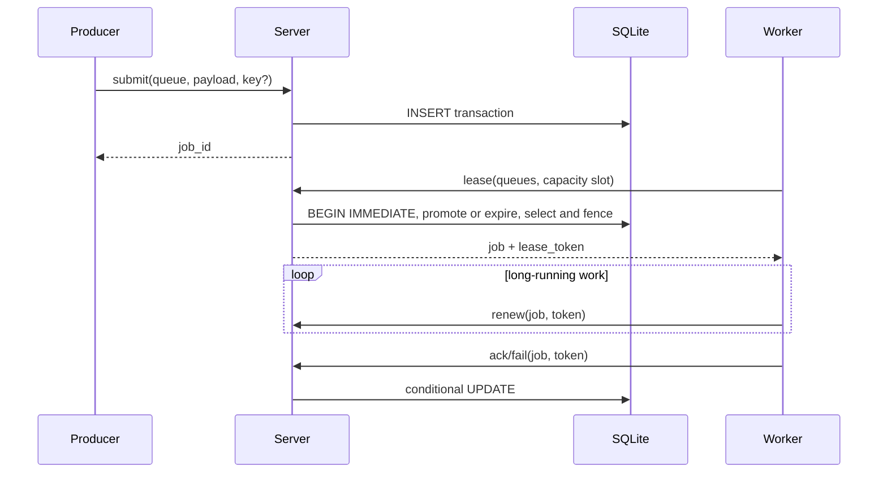

<!-- Author: Torin Etheridge | Date: 2026-10-04 -->

# Architecture

Relay is a single-coordinator, durable queue. Protocol handlers are concurrent Tokio tasks; all correctness-critical state changes enter a small synchronous store API backed by one SQLite connection. SQLite WAL and `synchronous=FULL` provide crash-consistent commits.

## Components

## Persistence and recovery

The `jobs` row is the source of truth. State, attempts, schedule, retry policy, idempotency data, and lease metadata change atomically. A schema constraint requires all lease fields exactly when state is `leased`. On startup, Relay invalidates every old lease and returns it to `ready`; completed and dead rows are untouched.

SQLite serializes writes, matching Relay's one-coordinator model. This limits horizontal write scale but keeps ownership proofs local and understandable. A replicated version would need a consensus-backed transaction boundary, not merely multiple servers sharing a file.

## Concurrency

TCP connections and worker tasks are bounded. Workers acquire a semaphore permit before asking for a lease, so leased work never exceeds configured concurrency. Server handlers do no in-memory buffering of jobs. Store calls are short, serialized critical sections; the durable database absorbs backlog.

## Scheduler

Delayed and retrying rows become ready after `available_at_ms`. The 250 ms sweeper reduces idle latency; every lease transaction also promotes eligible rows and expires leases, so correctness does not depend on the background task. Selection orders by an aged priority and then creation time.

## Invariants

1. A transaction creates at most one current token per job.
2. Only an unexpired matching `(job, worker, token)` may renew, ACK, or fail.
3. Attempts increment in the same transaction that publishes a lease and never decrease except explicit dead-letter replay.
4. Terminal jobs are absent from scheduler queries.
5. A job is removed only by an explicit dead purge.

## Shutdown

SIGINT stops accepting work, signals background tasks, and waits up to five seconds for them. Client connections are independent tasks and OS closure handles stragglers. Workers stop claiming, allow their currently spawned jobs a brief drain, and then exit; unfinished leases are recovered by expiry. A future release should expose a configurable full worker drain timeout.
